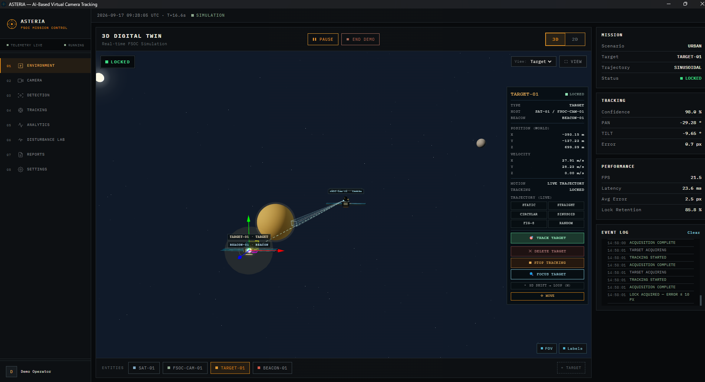
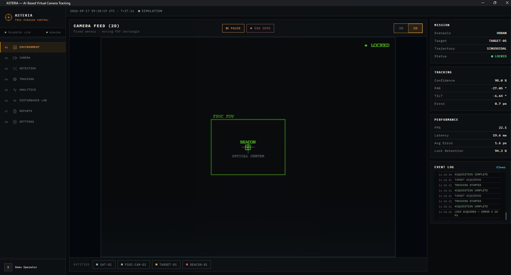
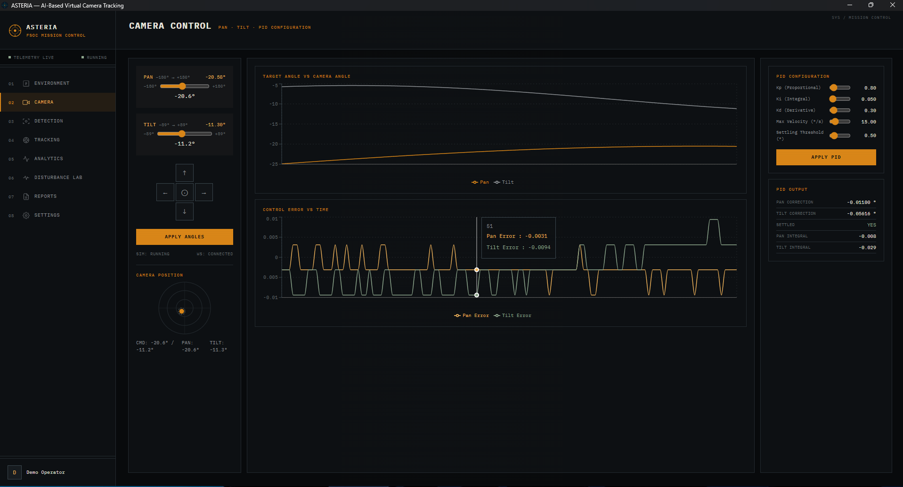
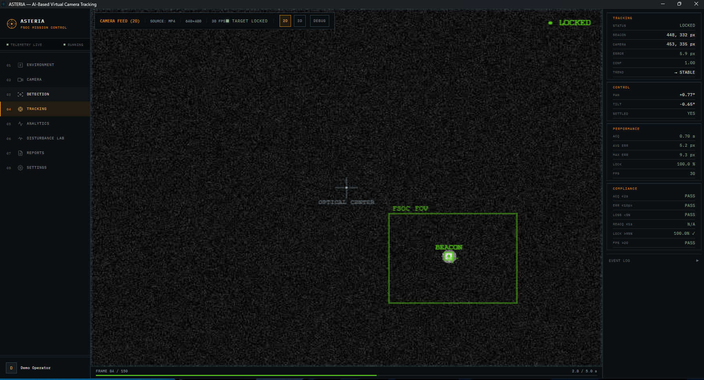
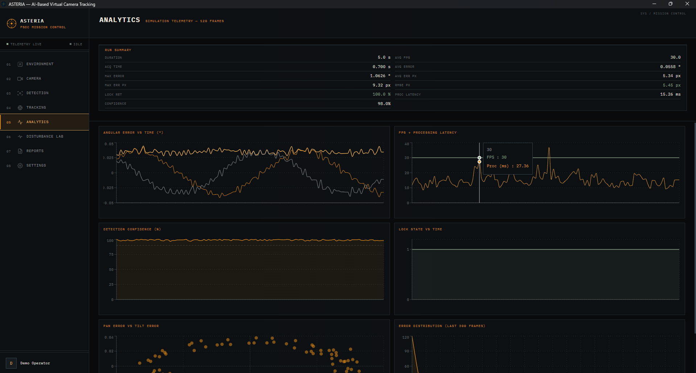
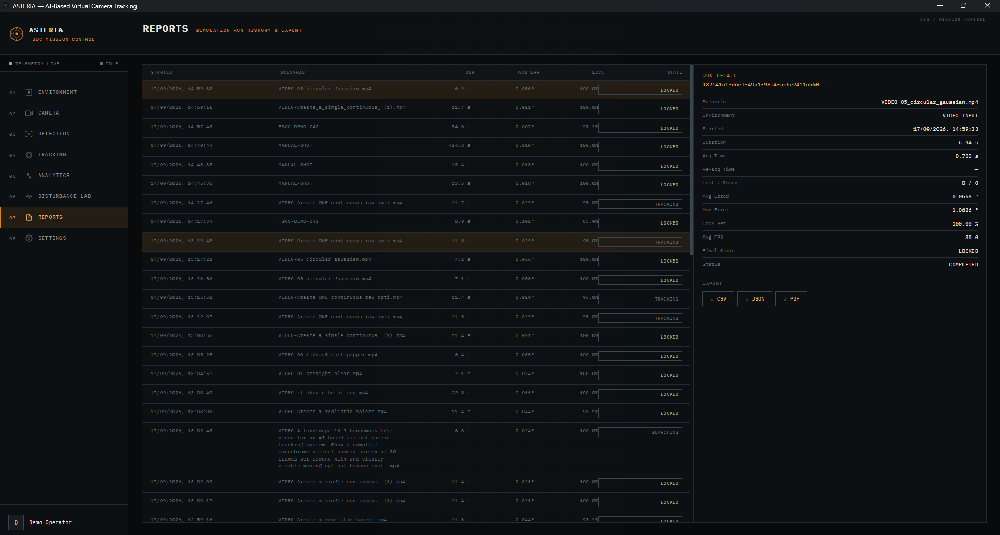

# ASTERIA — FSOC Virtual PAT

### AI-Assisted Virtual Camera Tracking System for Coarse Alignment of Free Space Optical Communication (FSOC) Terminals

> **SEE · ACQUIRE · TRACK · ALIGN**

🌐 **Live Demo:**  
https://asteria-fsoc.vercel.app/

📌 **GitHub Repository:**  
https://github.com/soham-salunkhe/Asteria

📦 **Asteria v1.0.0 — Download:**  
https://github.com/soham-salunkhe/Asteria/releases/tag/v1.0.0

ASTERIA is a **standalone software simulation and benchmarking platform** for coarse Pointing, Acquisition and Tracking (PAT) in Free Space Optical Communication (FSOC).

It simulates a moving optical beacon, detects and tracks it using computer vision, estimates its motion with a Kalman Filter, and continuously corrects a virtual pan/tilt camera using closed-loop PID control.

ASTERIA also supports **MP4 benchmark-video input**, real-time performance monitoring, automated reports, and a packaged Windows desktop application.

---

## 🚀 Run ASTERIA — No Website Setup Required

**You do not need to run the frontend, backend, Python service, or a local website to use the released application.**

Download the packaged Windows application from the official GitHub release:

### [⬇️ Download ASTERIA v1.0.0](https://github.com/soham-salunkhe/Asteria/releases/tag/v1.0.0)

Available builds:

- **`ASTERIA-Setup-1.0.0.exe`** — Windows installer
- **`ASTERIA-Portable-1.0.0.exe`** — portable version; suitable for running without a traditional installation

### Quick Start

```text
Download ASTERIA
       ↓
Launch Application
       ↓
START DEMO
       ↓
Beacon Acquisition
       ↓
TARGET LOCKED
       ↓
Live Tracking + Performance Monitoring
```

The packaged application starts the required local services automatically. **No browser-based website deployment is required for the released desktop build.**

---

## 💻 Running from Source (Developers)

If cloning the repository from GitHub:

### Option A: 1-Click Launcher (Windows)
Double-click **`start.bat`** in the repository root. It starts all services automatically:
- **Python Simulation Engine:** `http://localhost:8000`
- **Node Backend Copilot Proxy:** `http://localhost:5001`
- **Frontend Web App:** `http://localhost:5173`

### Option B: Manual Terminal Launch
1. **Python Tracking Engine:**
   ```bash
   cd ai-service
   pip install -r requirements.txt
   python -m uvicorn fsoc_main:app --host 127.0.0.1 --port 8000
   ```
2. **Frontend:**
   ```bash
   cd frontend
   npm install
   npm run dev
   ```
3. Open **`http://localhost:5173`** and click **START DEMO** or **START CUSTOM**.

---

# 🛰️ What is ASTERIA?

Free Space Optical Communication uses highly directional laser beams to transmit data between platforms such as satellites, UAVs and ground terminals.

Before fine pointing can take over, the system must first perform **coarse alignment**:

> **SEE → ACQUIRE → TRACK → ALIGN**

ASTERIA provides a software-based environment for developing and evaluating this coarse alignment process without requiring physical optical hardware.

### The core loop

```text
Virtual Environment / MP4 Video
             ↓
      Moving Optical Beacon
             ↓
        Virtual Camera
             ↓
      Beacon Detection
             ↓
    Centroid Estimation
             ↓
       Kalman Filter
             ↓
     Pixel Tracking Error
             ↓
       PID Controller
             ↓
     Pan / Tilt Correction
             ↓
      Camera Re-aims
             ↓
        TARGET LOCK
             ↓
   Performance Analysis
             ↺
```

---

# 🧠 Key Capabilities

### 🌌 Virtual FSOC Environment
- Three.js / WebGL 3D simulation
- Moving optical beacon
- Virtual camera and configurable FOV
- Satellite/UAV-style scenarios
- Configurable target trajectories

### 🌪️ Realistic Disturbances
- Gaussian noise
- Poisson noise
- Salt & Pepper noise
- Atmospheric degradation
- Platform motion
- Camera jitter
- Low-light / contrast variation

### 👁️ Beacon Tracking
- Adaptive classical computer vision
- Connected-component analysis
- Photometric scoring
- Temporal association
- Centroid estimation
- Confidence estimation

### 📈 State Estimation
- Real NumPy-based Kalman Filter
- Position estimation
- Velocity estimation
- Motion prediction
- Measurement smoothing

### 🎯 Closed-Loop Control
- Pixel error calculation
- Feedforward compensation
- Dual-axis PID controller
- Pan / tilt correction
- Configurable gimbal limits
- Target lock management

### 🎥 Benchmark Mode
- MP4 video input
- 30 FPS benchmark processing
- Same tracking pipeline as simulation
- Real-time beacon and camera coordinates
- Lock / loss monitoring

### 📊 Performance & Reporting
- Acquisition time
- Average tracking error
- Maximum error
- RMSE
- Lock retention
- Target loss
- Re-acquisition time
- FPS
- Processing latency
- CSV / JSON / PDF reports

---

# 🖥️ Application Preview

## Mission Control — 3D Digital Twin

ASTERIA provides a real-time 3D environment for visualizing the terminal, beacon, camera FOV and tracking state.

<p align="center">
  
</p>

---

## Autonomous Beacon Tracking

During a run, ASTERIA continuously estimates the beacon state and updates the camera while exposing live confidence, pan/tilt, error and performance telemetry.

<p align="center">
  
</p>

---

## 2D Camera Feed

The 2D view exposes the optical camera FOV and beacon position directly, making the coarse-pointing behaviour easy to inspect.

<p align="center">
  
</p>

---

## Camera Control & PID

The camera-control module exposes pan/tilt state, target-vs-camera angle, control error and PID configuration.

<p align="center">
  
</p>

---

## MP4 Benchmark Mode

ASTERIA can process an external video stream instead of relying only on the internal 3D simulation.

<p align="center">
  
</p>

---

## Analytics

Every run can be evaluated using tracking-error, FPS, processing-latency, confidence and lock-state telemetry.

<p align="center">
  
</p>

---

## Reports

Run history and detailed results can be exported for analysis and benchmarking.

<p align="center">
  
</p>

---

# 🏗️ System Architecture

```text
                         USER CONFIGURATION
                               │
        ┌──────────────────────┼──────────────────────┐
        ↓                      ↓                      ↓
   TARGET MODEL          CAMERA MODEL          DISTURBANCE
   Motion / Beacon       FOV / FPS / PTZ       Noise / Atmosphere
        │                      │                      │
        └──────────────────────┼──────────────────────┘
                               ↓
                    ┌────────────────────┐
                    │  THREE.JS / WEBGL  │
                    │  VIRTUAL WORLD     │
                    └─────────┬──────────┘
                              ↓
                    ┌────────────────────┐
                    │ VIRTUAL CAMERA /   │
                    │ VIDEO STREAM       │
                    └─────────┬──────────┘
                              ↓
                    ┌────────────────────┐
                    │ AI + COMPUTER      │
                    │ VISION DETECTOR    │
                    └─────────┬──────────┘
                              ↓
                    ┌────────────────────┐
                    │ CENTROID +         │
                    │ CONFIDENCE         │
                    └─────────┬──────────┘
                              ↓
                    ┌────────────────────┐
                    │ KALMAN FILTER      │
                    │ PREDICT + SMOOTH   │
                    └─────────┬──────────┘
                              ↓
                    ┌────────────────────┐
                    │ TRACKING & LOCK    │
                    │ MANAGEMENT         │
                    └─────────┬──────────┘
                              ↓
                    ┌────────────────────┐
                    │ ERROR + PID        │
                    │ CONTROL            │
                    └─────────┬──────────┘
                              ↓
                    ┌────────────────────┐
                    │ VIRTUAL PAN / TILT │
                    └─────────┬──────────┘
                              │
                    ┌─────────┴─────────┐
                    ↓                   ↓
              CAMERA VIEW          ANALYTICS
               UPDATED             FPS / RMSE
                                  Acquisition
                                  Re-lock / Error
                    │                   │
                    └─────────┬─────────┘
                              ↓
                       CLOSED-LOOP
                         TRACKING
```

---

# 🔬 Tracking Pipeline

## Beacon Detection

The operational detector is **classical computer vision**, using an adaptive pipeline rather than requiring a trained beacon dataset.

```text
Input Frame
     ↓
Adaptive Thresholding
     ↓
Connected Components
     ↓
Photometric Scoring
     ↓
Candidate Filtering
     ↓
Temporal Association
     ↓
Beacon Centroid
```

ASTERIA exposes a `DetectorInterface` so alternative detectors can be integrated without replacing the downstream tracking and control pipeline.

> **Note:** A `YOLODetector` adapter exists as an integration point, but trained YOLO beacon weights are not included in the repository. The operational tracking path uses the classical CV detector.

---

# 📈 Kalman Filter

The Kalman Filter estimates the beacon state from noisy visual measurements.

```text
Measured Position
       ↓
  Kalman Filter
       ↓
Estimated State
       ↓
Predicted Position
```

It provides:

- Position estimation
- Velocity estimation
- Measurement smoothing
- Motion prediction
- Improved robustness to noisy measurements

---

# 🎯 PID Camera Control

The estimated target position is converted into camera corrections.

```text
Target Position
       ↓
Camera Center
       ↓
Pixel Error ΔX / ΔY
       ↓
PID Controller
       ↓
Pan / Tilt Command
       ↓
Virtual Camera
       ↓
Updated Camera View
       ↺
```

---

# 🎥 Benchmark-2 Mode

ASTERIA supports external MP4 video input for benchmark evaluation.

```text
MP4 Video @ 30 FPS
        ↓
Video Processor
        ↓
Beacon Detection
        ↓
Centroid Estimation
        ↓
Kalman Prediction
        ↓
Tracking / Control
        ↓
Performance Metrics
```

This enables the same tracking pipeline to operate on supplied video scenarios instead of only the internal simulation.

---

# 📊 Performance Metrics

ASTERIA evaluates the tracking system against the PS169 performance targets.

| Metric | Requirement |
|---|---:|
| Acquisition Time | ≤ 2 s |
| Average Tracking Error | ≤ 10 px |
| RMSE Tracking Error | ≤ 10 px |
| Lock Retention | > 95% |
| Target Loss | < 5% |
| Re-acquisition Time | ≤ 1 s |
| Processing Speed | ≥ 20 FPS |

Additional telemetry includes:

- Maximum tracking error
- Processing latency
- Detection confidence
- Per-frame lock state
- Loss reasons
- Eligible / locked / unlocked frame counts

---

# 🧪 Simulation Parameters

| Parameter | Default |
|---|---|
| Target Trajectory | Sinusoidal |
| Horizontal Amplitude | 90 m |
| Vertical Amplitude | 45 m |
| Period | 18 s |
| Camera FOV | 4° × 3° |
| Sensor | 640 × 480 @ 30 Hz |
| Beacon Shape | Square |
| Beacon Size | 10 px |
| Gimbal Limit | 5°/s |

### Supported trajectories

```text
Linear
Sinusoidal
Circular
Figure-8
Random Walk
Spiral
```

---

# 🖥️ Application Modules

| Module | Purpose |
|---|---|
| **Mission Control** | 3D digital twin, mission status and live metrics |
| **Live Tracking** | Camera feed and tracking telemetry |
| **Detection** | Detection pipeline and confidence |
| **Camera Control** | Pan/tilt and PID configuration |
| **Disturbance Lab** | Noise, atmosphere and motion disturbances |
| **Analytics** | Tracking and performance graphs |
| **Reports** | Run history and export |
| **Settings** | System configuration |
| **Gemini Copilot** | AI-assisted engineering analysis |

---

# 🧩 Technology Stack

### Frontend
- React
- TypeScript
- Vite
- Three.js / WebGL

### Tracking Engine
- Python
- FastAPI
- OpenCV
- NumPy
- Kalman Filter
- PID Controller

### Backend
- Node.js
- Express
- WebSocket

### Desktop
- Electron

### Data & Reporting
- SQLite
- CSV
- JSON
- PDF

### AI Assistance
- Gemini Engineering Copilot

---

# 📁 Project Structure

```text
ASTERIA/
│
├── frontend/
│   └── src/
│       ├── pages/
│       ├── components/
│       ├── hooks/
│       ├── services/
│       └── types/
│
├── backend/
│   └── src/routes/
│
├── ai-service/
│   ├── fsoc_main.py
│   ├── simulation/
│   ├── prediction/
│   ├── control/
│   ├── vision/
│   ├── analytics/
│   ├── reports/
│   └── database/
│
├── electron/
├── docs/
│   ├── ASTERIA_FSOC_Technical_Report_FINAL.pdf
│   └── ASTERIA_User_Manual.pdf
│
└── release/
```

---

# 🛠️ Developer Setup

The **packaged application does not require this setup**.

These steps are only required for developers working directly with the source code.

## Requirements

- Python 3.11+
- Node.js 20+

### Tracking Engine

```bash
cd ai-service
pip install -r requirements.txt
python -m uvicorn fsoc_main:app --reload --port 8000
```

### Backend

```bash
cd backend
npm install
npm run dev
```

### Frontend

```bash
cd frontend
npm install
npm run dev
```

---

# 🖥️ Build the Desktop Application

```bash
npm run dist:all
```

The packaged builds are generated in:

```text
release/
├── ASTERIA-Setup-1.0.0.exe
└── ASTERIA-Portable-1.0.0.exe
```

---

# 🔐 Environment Variables

### `frontend/.env`

```env
VITE_FIREBASE_API_KEY=
VITE_FIREBASE_AUTH_DOMAIN=
VITE_FIREBASE_PROJECT_ID=
VITE_FIREBASE_STORAGE_BUCKET=
VITE_FIREBASE_MESSAGING_SENDER_ID=
VITE_FIREBASE_APP_ID=

VITE_FSOC_API_URL=http://localhost:8000
VITE_FSOC_WS_URL=ws://localhost:8000/ws/simulation
VITE_API_URL=http://localhost:5001/api
```

### `backend/.env`

```env
PORT=5001
GEMINI_API_KEY=your_gemini_api_key_here
```

---

# 📚 Documentation

### Technical Report

```text
docs/ASTERIA_FSOC_Technical_Report_FINAL.pdf
```

Contains the system architecture, tracking methodology, computer-vision pipeline, Kalman filtering, PID control, simulation methodology and performance evaluation.

### User Manual

```text
docs/ASTERIA_User_Manual.pdf
```

Contains installation, application workflow, GUI description, configuration and operation instructions.

---

# 🌌 Engineering Philosophy

ASTERIA follows a complete closed-loop engineering workflow:

```text
SIMULATE
    ↓
DETECT
    ↓
ESTIMATE
    ↓
PREDICT
    ↓
CONTROL
    ↓
ALIGN
    ↓
MEASURE
    ↺
```

The objective is not simply to detect a beacon.

It is to provide a **software testbed for FSOC coarse alignment** where algorithms can be simulated, stressed with disturbances, evaluated against measurable performance targets, and improved before physical deployment.

---

# ASTERIA

### SEE · ACQUIRE · TRACK · ALIGN

**A software-defined path from virtual testing to reliable optical communication.**

[⬇️ Download ASTERIA v1.0.0](https://github.com/soham-salunkhe/Asteria/releases/tag/v1.0.0)